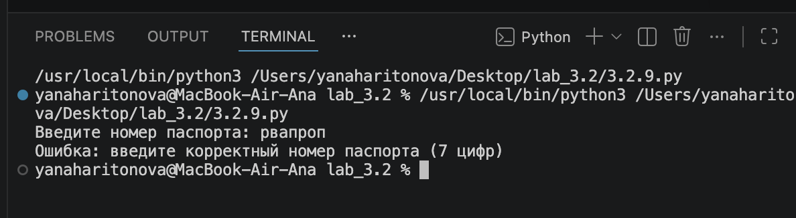

# check_passport.py

Программа проверяет допуск к вылету по номеру паспорта. Номер вводится пользователем, затем ищется в базе данных (словарь `passports`). В зависимости от результата выводится одно из трёх сообщений: вылет разрешён, вылет запрещён или паспорт не найден.

---

## Корректное выполнение

**Вводимое значение:** `1234567`

Номер присутствует в базе, значение — `True`. Программа выводит:

```
Введите номер паспорта: 1234567
Вылет разрешён
```

**Скриншот терминала:**


---

## Некорректное выполнение

**Вводимое значение:** `рвапроп`

Функция `int()` не может преобразовать буквенную строку в число. Срабатывает блок `except ValueError`, и вместо системной ошибки программа выводит понятное сообщение:

```
Введите номер паспорта: abc
Ошибка: введите корректный номер паспорта (7 цифр)
```

**Скриншот терминала:**


